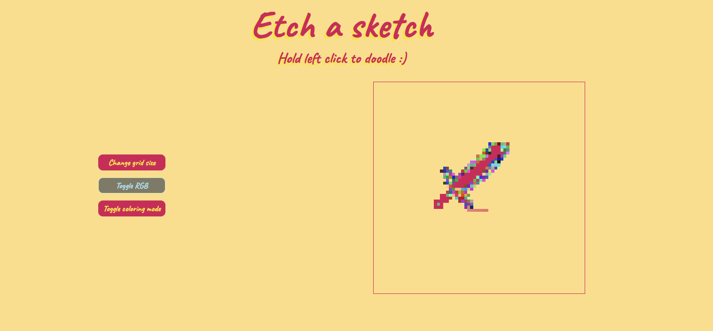

# Etch-a-sketch

## Project overview

- Description: A simple drawing toy inpsired by the classical Etch A Sketch
- Technologies used: JavaScript, HTML, CSS

## Features

- Size adjustable drawing grid 
- RGB mode that colors each square in a random color
- Coloring mode that reduces each square's opacity from 0% to 100% and vice-versa

## How to start 

- To run use this [link](https://popovdn.github.io/Etch-a-sketch/)
- You can also clone the repository locally and run the code on local dev server or open the index.html file in a browser

## How to use

- Simply hold the left mouse button and drag your mouse within the border of the drawing space
- RGB mode and Coloring mode can be turned on/off using the buttons next to the drawing space

## Core functions

- `createGrid(size = 16)`: Creates a grid of square elements based on the provided size. The default grid size is 16x16. Each square is sized according to the grid dimensions and styled with additional functionality.
- `styleGridItem(gridItem, squareSize)`: Styles each grid square with a specified width and height (in pixels). The square’s size is determined by the total grid size divided by the number of squares per row.
- `changeGridSize()`: Prompts the user to specify a new grid size up to a maximum of 100. It validates the input and then resets the grid with the newly specified size.
- `RGB()`: Generates and returns a random RGB color string. Each color component (red, green, blue) is randomly set between 0 and 255.
- `coloringMode()`: Increments an opacity counter to adjust the opacity level, cycling back to 1 after reaching 100%. Returns the current opacity as a percentage string.
- `addGridFunctionality(gridItem)`: Adds interactivity to each grid square. On mouseout, changes the square's background color based on the selected mode (default or RGB color) and adjusts opacity if coloring mode is enabled.

## A screenshot of the toy

